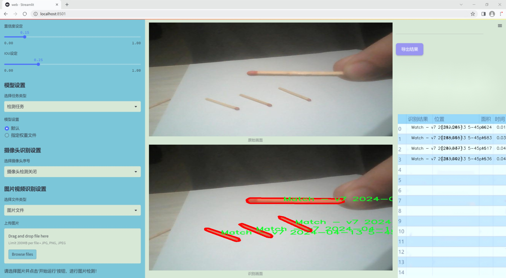
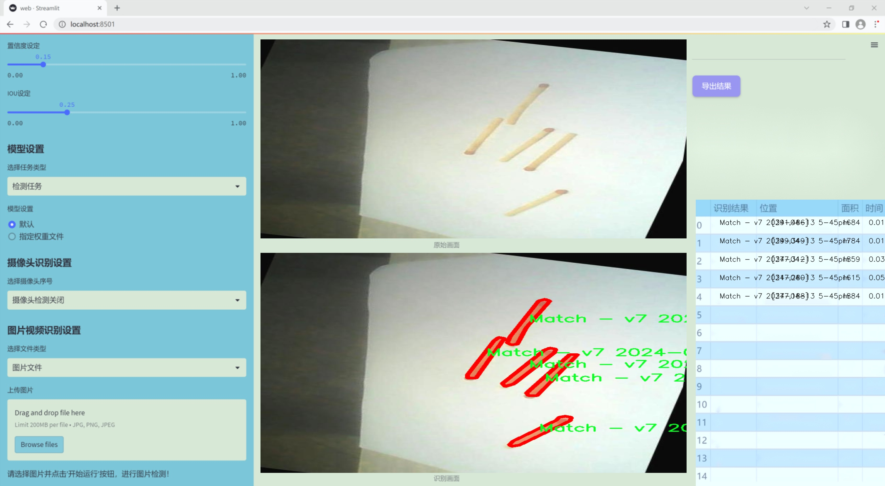
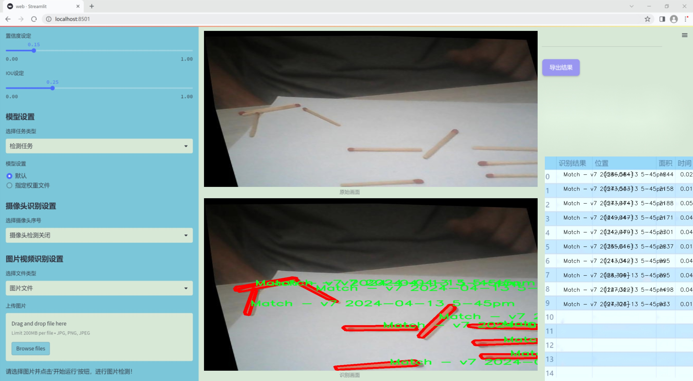
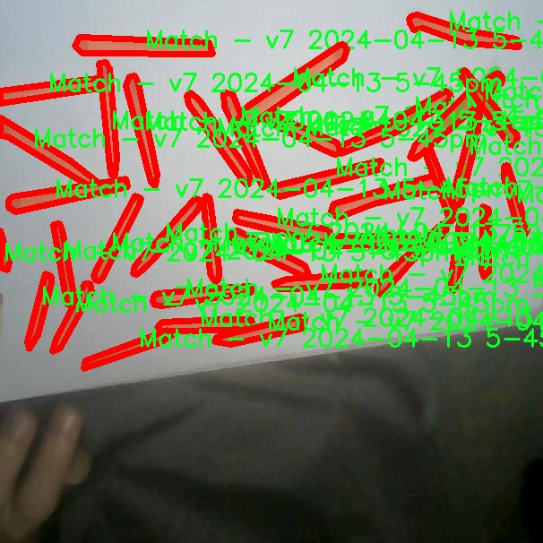
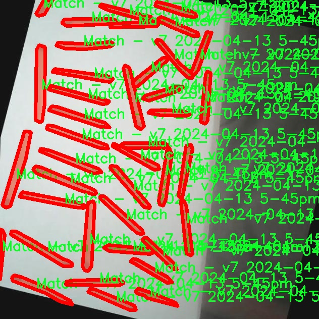
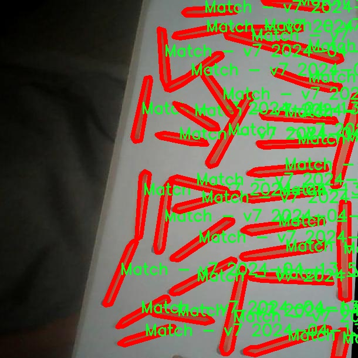
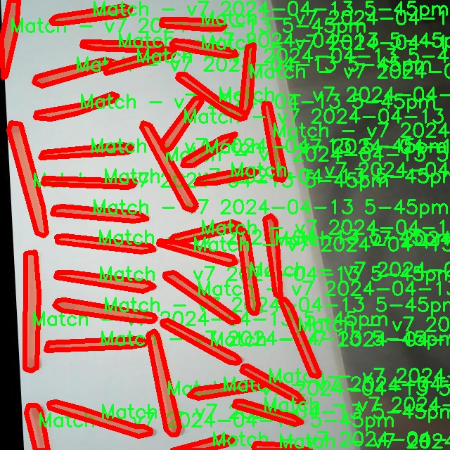
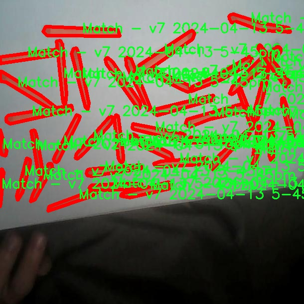

### 1.背景意义

研究背景与意义

在计算机视觉领域，实例分割技术作为一种重要的图像处理方法，近年来得到了广泛的关注和应用。实例分割不仅能够识别图像中的物体类别，还能精确地分割出每个物体的轮廓，提供更为细致的视觉信息。这一技术在自动驾驶、医疗影像分析、工业检测等多个领域展现出了巨大的潜力。随着深度学习技术的快速发展，基于卷积神经网络（CNN）的实例分割算法不断涌现，其中YOLO（You Only Look Once）系列模型因其高效性和实时性而备受青睐。

本研究旨在基于改进的YOLOv11模型，构建一个专门针对火柴的实例分割系统。火柴作为一种日常生活中常见的物品，其在图像识别中的应用相对较少，但其简单的形状和颜色特征使其成为实例分割研究的理想对象。通过构建一个包含2800张火柴图像的数据集，研究将能够深入探讨YOLOv11在处理特定类别物体时的性能表现。该数据集的设计不仅考虑了样本数量的丰富性，还通过多种数据增强技术提升了模型的泛化能力。

此外，火柴实例分割系统的研究具有重要的实际意义。随着智能家居和自动化设备的普及，能够精准识别和处理日常物品的计算机视觉系统将极大提升人机交互的智能化水平。通过对火柴的精确分割与识别，未来可以为相关领域的应用提供基础，例如在智能厨房中识别火柴的使用情况，或在安全监控中检测潜在的火灾隐患。

综上所述，基于改进YOLOv11的火柴实例分割系统不仅能够推动实例分割技术的发展，还能为实际应用提供有力支持，具有重要的研究价值和应用前景。

### 2.视频效果

[2.1 视频效果](https://www.bilibili.com/video/BV1W4k7YqEox/)

### 3.图片效果







##### [项目涉及的源码数据来源链接](https://kdocs.cn/l/cszuIiCKVNis)**

注意：本项目提供训练的数据集和训练教程,由于版本持续更新,暂不提供权重文件（best.pt）,请按照6.训练教程进行训练后实现上图演示的效果。

### 4.数据集信息

##### 4.1 本项目数据集类别数＆类别名

nc: 1
names: ['Match - v7 2024-04-13 5-45pm']


该项目为【图像分割】数据集，请在【训练教程和Web端加载模型教程（第三步）】这一步的时候按照【图像分割】部分的教程来训练

##### 4.2 本项目数据集信息介绍

本项目数据集信息介绍

本项目所使用的数据集专注于“MatchSegmentation”主题，旨在为改进YOLOv11的火柴实例分割系统提供高质量的训练数据。该数据集的设计旨在支持火柴图像的精确分割，确保模型能够有效识别和处理不同场景中的火柴实例。数据集中包含一个类别，具体为“Match - v7 2024-04-13 5-45pm”，这一类别的命名不仅反映了数据集的创建时间，也体现了其针对火柴实例的专门化特征。

数据集的构建过程经过精心设计，涵盖了多种不同背景和光照条件下的火柴图像，以确保模型在多样化环境中的鲁棒性。每个图像都经过精确标注，确保火柴的轮廓和细节得以清晰呈现，这对于实例分割任务至关重要。通过这种方式，数据集不仅提供了丰富的视觉信息，还为模型的训练提供了坚实的基础，使其能够在实际应用中实现更高的准确性和效率。

此外，数据集的多样性和丰富性使其成为研究火柴实例分割的理想选择。随着YOLOv11的改进，研究人员能够利用这一数据集进行深入的实验和分析，从而推动火柴图像处理技术的发展。通过对该数据集的深入挖掘和应用，项目团队期望能够在火柴实例分割领域取得突破性进展，为相关应用提供更为精准和高效的解决方案。总之，本项目的数据集不仅为模型训练提供了必要的支持，也为未来的研究和应用奠定了坚实的基础。











### 5.全套项目环境部署视频教程（零基础手把手教学）

[5.1 所需软件PyCharm和Anaconda安装教程（第一步）](https://www.bilibili.com/video/BV1BoC1YCEKi/?spm_id_from=333.999.0.0&vd_source=bc9aec86d164b67a7004b996143742dc)


[5.2 安装Python虚拟环境创建和依赖库安装视频教程（第二步）](https://www.bilibili.com/video/BV1ZoC1YCEBw?spm_id_from=333.788.videopod.sections&vd_source=bc9aec86d164b67a7004b996143742dc)

### 6.改进YOLOv11训练教程和Web_UI前端加载模型教程（零基础手把手教学）

[6.1 改进YOLOv11训练教程和Web_UI前端加载模型教程（第三步）](https://www.bilibili.com/video/BV1BoC1YCEhR?spm_id_from=333.788.videopod.sections&vd_source=bc9aec86d164b67a7004b996143742dc)


按照上面的训练视频教程链接加载项目提供的数据集，运行train.py即可开始训练



     Epoch   gpu_mem       box       obj       cls    labels  img_size
     1/200     20.8G   0.01576   0.01955  0.007536        22      1280: 100%|██████████| 849/849 [14:42<00:00,  1.04s/it]
               Class     Images     Labels          P          R     mAP@.5 mAP@.5:.95: 100%|██████████| 213/213 [01:14<00:00,  2.87it/s]
                 all       3395      17314      0.994      0.957      0.0957      0.0843

     Epoch   gpu_mem       box       obj       cls    labels  img_size
     2/200     20.8G   0.01578   0.01923  0.007006        22      1280: 100%|██████████| 849/849 [14:44<00:00,  1.04s/it]
               Class     Images     Labels          P          R     mAP@.5 mAP@.5:.95: 100%|██████████| 213/213 [01:12<00:00,  2.95it/s]
                 all       3395      17314      0.996      0.956      0.0957      0.0845

     Epoch   gpu_mem       box       obj       cls    labels  img_size
     3/200     20.8G   0.01561    0.0191  0.006895        27      1280: 100%|██████████| 849/849 [10:56<00:00,  1.29it/s]
               Class     Images     Labels          P          R     mAP@.5 mAP@.5:.95: 100%|███████   | 187/213 [00:52<00:00,  4.04it/s]
                 all       3395      17314      0.996      0.957      0.0957      0.0845


###### [项目数据集下载链接](https://kdocs.cn/l/cszuIiCKVNis)

### 7.原始YOLOv11算法讲解

YOLO11采用改进的骨干和颈部架构，增强了特征提取能力，提高了物体检测的精确度和复杂任务的表现。YOLO11引入精炼的架构设计和优化的训练流程，实现更快的处理速度，同时保持精度和性能之间的最佳平衡。通过模型设计的进步，YOLO11m在COCO数据集上实现了更高的均值平均精度（mAP），同时使用比YOLOv8m少22%的参数，使其在不妥协准确性的情况下更加计算高效。YOLO11可以无缝部署在各种环境中，包括边缘设备、云平台以及支持NVIDIA
GPU的系统，确保最大灵活性。无论是物体检测、实例分割、图像分类、姿态估计，还是定向物体检测（OBB），YOLO11都旨在应对多样的计算机视觉挑战。


##### **Ultralytics YOLO11相比于之前版本的主要改进有哪些？**

Ultralytics YOLO11在其前身基础上引入了几项重要进步。主要改进包括：

  1. **增强的特征提取** ：YOLO11采用改进的骨干和颈部架构，增强了特征提取能力，提高了物体检测的精确度。
  2.  **优化的效率和速度** ：精炼的架构设计和优化的训练流程实现了更快的处理速度，同时保持了准确性和性能之间的平衡。
  3.  **更高的准确性与更少的参数** ：YOLO11m在COCO数据集上实现了更高的均值平均精度（mAP），同时使用比YOLOv8m少22%的参数，使其在不妥协准确性的情况下更加计算高效。
  4.  **环境适应性强** ：YOLO11可以在多种环境中部署，包括边缘设备、云平台以及支持NVIDIA GPU的系统。
  5.  **支持广泛的任务** ：YOLO11支持多种计算机视觉任务，如物体检测、实例分割、图像分类、姿态估计和定向物体检测（OBB）。

我们先来看一下其网络结构有什么变化，可以看出，相比较于YOLOv8模型，其将CF2模块改成C3K2，同时在SPPF模块后面添加了一个C2PSA模块，且将YOLOv10的head思想引入到YOLO11的head中，使用深度可分离的方法，减少冗余计算，提高效率。下面我们来详细看一下这两个模块的结构是怎么构成的，以及它们为什么要这样设计


##### C3K2的网络结构

从下面图中我们可以看到，C3K2模块其实就是C2F模块转变出来的，它代码中有一个设置，就是当c3k这个参数为FALSE的时候，C3K2模块就是C2F模块，也就是说它的Bottleneck是普通的Bottleneck；反之当它为true的时候，将Bottleneck模块替换成C3模块。


##### C2PSA的网络结构

` `C2PSA是对 `C2f` 模块的扩展，它结合了PSA(Pointwise Spatial
Attention)块，用于增强特征提取和注意力机制。通过在标准 `C2f` 模块中引入 PSA
块，C2PSA实现了更强大的注意力机制，从而提高了模型对重要特征的捕捉能力。


##### **C2f 模块回顾：**

**** C2f模块是一个更快的 CSP（Cross Stage Partial）瓶颈实现，它通过两个卷积层和多个 Bottleneck
块进行特征提取。相比传统的 CSPNet，C2f 优化了瓶颈层的结构，使得计算速度更快。在 C2f中，`cv1` 是第一个 1x1
卷积，用于减少通道数；`cv2` 是另一个 1x1 卷积，用于恢复输出通道数。而 `n` 是一个包含 Bottleneck 块的数量，用于提取特征。

##### **C2PSA 模块的增强** ：

**C2PSA** 扩展了 C2f，通过引入PSA( **Position-Sensitive Attention)**
，旨在通过多头注意力机制和前馈神经网络来增强特征提取能力。它可以选择性地添加残差结构（shortcut）以优化梯度传播和网络训练效果。同时，使用FFN
可以将输入特征映射到更高维的空间，捕获输入特征的复杂非线性关系，允许模型学习更丰富的特征表示。

##### head部分

YOLO11在head部分的cls分支上使用深度可分离卷积 ，具体代码如下，cv2边界框回归分支，cv3分类分支。

    
    
     self.cv2 = nn.ModuleList(
                nn.Sequential(Conv(x, c2, 3), Conv(c2, c2, 3), nn.Conv2d(c2, 4 * self.reg_max, 1)) for x in ch
            )
            self.cv3 = nn.ModuleList(
                nn.Sequential(
                    nn.Sequential(DWConv(x, x, 3), Conv(x, c3, 1)),
                    nn.Sequential(DWConv(c3, c3, 3), Conv(c3, c3, 1)),
                    nn.Conv2d(c3, self.nc, 1),
                )
                for x in ch
            )


### 8.200+种全套改进YOLOV11创新点原理讲解

#### 8.1 200+种全套改进YOLOV11创新点原理讲解大全

由于篇幅限制，每个创新点的具体原理讲解就不全部展开，具体见下列网址中的改进模块对应项目的技术原理博客网址【Blog】（创新点均为模块化搭建，原理适配YOLOv5~YOLOv11等各种版本）

[改进模块技术原理博客【Blog】网址链接](https://gitee.com/qunmasj/good)


#### 8.2 精选部分改进YOLOV11创新点原理讲解

###### 这里节选部分改进创新点展开原理讲解(完整的改进原理见上图和[改进模块技术原理博客链接](https://gitee.com/qunmasj/good)【如果此小节的图加载失败可以通过CSDN或者Github搜索该博客的标题访问原始博客，原始博客图片显示正常】


### D-LKA Attention简介
自2010年代中期以来，卷积神经网络（CNNs）已成为许多计算机视觉应用的首选技术。它们能够从原始数据中自动提取复杂的特征表示，无需手动进行特征工程，这引起了医学图像分析社区的极大兴趣。许多成功的CNN架构，如U-Net、全卷积网络、DeepLab或SegCaps（分割胶囊），已经被开发出来。这些架构在语义分割任务中取得了巨大成功，先前的最新方法已经被超越。

在计算机视觉研究中，不同尺度下的目标识别是一个关键问题。在CNN中，可检测目标的大小与相应网络层的感受野尺寸密切相关。如果一个目标扩展到超出这个感受野的边界，这可能会导致欠分割结果。相反，与目标实际大小相比使用过大的感受野可能会限制识别，因为背景信息可能会对预测产生不必要的影响。

解决这个问题的一个有希望的方法涉及在并行使用具有不同尺寸的多个Kernel，类似于Inception块的机制。然而，由于参数和计算要求的指数增长，将Kernel大小增加以容纳更大的目标在实践中受到限制。因此，出现了各种策略，包括金字塔池化技术和不同尺度的扩张卷积，以捕获多尺度的上下文信息。

另一个直观的概念涉及将多尺度图像金字塔或它们的相关特征表示直接纳入网络架构。然而，这种方法存在挑战，特别是在管理训练和推理时间方面的可行性方面存在挑战。在这个背景下，使用编码器-解码器网络，如U-Net，已被证明是有利的。这样的网络在较浅的层中编码外观和位置，而在更深的层中，通过神经元的更广泛的感受野捕获更高的语义信息和上下文信息。

一些方法将来自不同层的特征组合在一起，或者预测来自不同尺寸的层的特征以使用多尺度的信息。此外，出现了从不同尺度的层中预测特征的方法，有效地实现了跨多个尺度的见解整合。然而，大多数编码器-解码器结构面临一个挑战：它们经常无法在不同尺度之间保持一致的特征，并主要使用最后一个解码器层生成分割结果。

语义分割是一项任务，涉及根据预定义的标签集为图像中的每个像素预测语义类别。这项任务要求提取高级特征同时保留初始的空间分辨率。CNNs非常适合捕获局部细节和低级信息，尽管以忽略全局上下文为代价。视觉Transformer（ViT）架构已经成为解决处理全局信息的视觉任务的关键，包括语义分割，取得了显著的成功。

ViT的基础是注意力机制，它有助于在整个输入序列上聚合信息。这种能力使网络能够合并远程的上下文提示，超越了CNN的有限感受野尺寸。然而，这种策略通常会限制ViT有效建模局部信息的能力。这种局限可能会妨碍它们检测局部纹理的能力，这对于各种诊断和预测任务至关重要。这种缺乏局部表示可以归因于ViT模型处理图像的特定方式。

ViT模型将图像分成一系列Patch，并使用自注意力机制来模拟它们之间的依赖关系。这种方法可能不如CNN模型中的卷积操作对感受野内提取局部特征有效。ViT和CNN模型之间的这种图像处理方法的差异可能解释了CNN模型在局部特征提取方面表现出色的原因。

近年来，已经开发出创新性方法来解决Transformer模型内部局部纹理不足的问题。其中一种方法是通过互补方法将CNN和ViT特征结合起来，以结合它们的优势并减轻局部表示的不足。TransUNet是这种方法的早期示例，它在CNN的瓶颈中集成了Transformer层，以模拟局部和全局依赖关系。HiFormer提出了一种解决方案，将Swin Transformer模块和基于CNN的编码器结合起来，生成两个多尺度特征表示，通过Double-Level Fusion模块集成。UNETR使用基于Transformer的编码器和CNN解码器进行3D医学图像分割。CoTr和TransBTS通过Transformer在低分辨率阶段增强分割性能，将CNN编码器和解码器连接在一起。

增强局部特征表示的另一种策略是重新设计纯Transformer模型内部的自注意力机制。在这方面，Swin-Unet在U形结构中集成了一个具有线性计算复杂性的Swin Transformer块作为多尺度 Backbone 。MISSFormer采用高效Transformer来解决视觉Transformer中的参数问题，通过在输入块上进行不可逆的降采样操作。D-Former引入了一个纯Transformer的管道，具有双重注意模块，以分段的方式捕获细粒度的局部注意和与多元单元的交互。然而，仍然存在一些特定的限制，包括计算效率低下，如TransUNet模型所示，对CNN Backbone 的严重依赖，如HiFormer所观察到的，以及对多尺度信息的忽略。

此外，目前的分割架构通常采用逐层处理3D输入 volumetric 的方法，无意中忽视了相邻切片之间的潜在相关性。这一疏忽限制了对 volumetric 信息的全面利用，因此损害了定位精度和上下文集成。此外，必须认识到，医学领域的病变通常在形状上发生变形。因此，用于医学图像分析的任何学习算法都必须具备捕捉和理解这些变形的能力。与此同时，该算法应保持计算效率，以便处理3D volumetric数据。

为了解决上述提到的挑战，作者提出了一个解决方案，即可变形大卷积核注意力模块（Deformable LKA module），它是作者网络设计的基本构建模块。这个模块明确设计成在有效处理上下文信息的同时保留局部描述符。作者的架构在这两个方面的平衡增强了实现精确语义分割的能力。

值得注意的是，参考该博客引入了一种基于数据的感受野的动态适应，不同于传统卷积操作中的固定滤波器Mask。这种自适应方法使作者能够克服与静态方法相关的固有限制。这种创新方法还扩展到了D-LKA Net架构的2D和3D版本的开发。

在3D模型的情况下，D-LKA机制被量身定制以适应3D环境，从而实现在不同 volumetric 切片之间无缝信息交互。最后，作者的贡献通过其计算效率得到进一步强调。作者通过仅依靠D-LKA概念的设计来实现这一点，在各种分割基准上取得了显著的性能，确立了作者的方法作为一种新的SOTA方法。

在本节中，作者首先概述方法论。首先，作者回顾了由Guo等人引入的大卷积核注意力（Large Kernel Attention，LKA）的概念。然后，作者介绍了作者对可变形LKA模块的创新探索。在此基础上，作者介绍了用于分割任务的2D和3D网络架构。

大卷积核提供了与自注意力机制类似的感受野。可以通过使用深度卷积、深度可扩展卷积和卷积来构建大卷积核，从而减少了参数和计算量。构建输入维度为和通道数的卷积核的深度卷积和深度可扩展卷积的卷积核大小的方程如下：


具有卷积核大小和膨胀率。参数数量和浮点运算（FLOPs）的计算如下：


FLOPs的数量与输入图像的大小成线性增长。参数的数量随通道数和卷积核大小的增加而呈二次增长。然而，由于它们通常都很小，因此它们不是限制因素。

为了最小化对于固定卷积核大小K的参数数量，可以将方程3对于膨胀率的导数设定为零：


例如，当卷积核大小为时，结果是。将这些公式扩展到3D情况是直接的。对于大小为和通道数C的输入，3D情况下参数数量和FLOPs 的方程如下：


具有卷积核大小和膨胀。


利用大卷积核进行医学图像分割的概念通过引入可变形卷积得以扩展。可变形卷积可以通过整数偏移自由调整采样网格以进行自由变形。额外的卷积层从特征图中学习出变形，从而创建一个偏移场。基于特征本身学习变形会导致自适应卷积核。这种灵活的卷积核形状可以提高病变或器官变形的表示，从而增强了目标边界的定义。

负责计算偏移的卷积层遵循其相应卷积层的卷积核大小和膨胀。双线性插值用于计算不在图像网格上的偏移的像素值。如图2所示，D-LKA模块可以表示为：


其中输入特征由表示，。表示为注意力图，其中每个值表示相应特征的相对重要性。运算符  表示逐元素乘法运算。值得注意的是，LKA不同于传统的注意力方法，它不需要额外的规范化函数，如或。这些规范化函数往往忽视高频信息，从而降低了基于自注意力的方法的性能。

在该方法的2D版本中，卷积层被可变形卷积所替代，因为可变形卷积能够改善对具有不规则形状和大小的目标的捕捉能力。这些目标在医学图像数据中常常出现，因此这种增强尤为重要。

然而，将可变形LKA的概念扩展到3D领域会带来一定的挑战。主要的约束来自于需要用于生成偏移的额外卷积层。与2D情况不同，由于输入和输出通道的性质，这一层无法以深度可分的方式执行。在3D环境中，输入通道对应于特征，而输出通道扩展到，其中是卷积核的大小。大卷积核的复杂性导致沿第3D的通道数扩展，导致参数和FLOPs大幅增加。因此，针对3D情况采用了另一种替代方法。在现有的LKA框架中，深度卷积之后引入了一个单独的可变形卷积层。这种战略性的设计调整旨在减轻扩展到3D领域所带来的挑战。


2D网络的架构如图1所示。第一变种使用MaxViT作为编码器组件，用于高效特征提取，而第二变种则结合可变形LKA层进行更精细、卓越的分割。

在更正式的描述中，编码器生成4个分层输出表示。首先，卷积干扰将输入图像的维度减小到。随后，通过4个MaxViT块的4个阶段进行特征提取，每个阶段后跟随降采样层。随着过程进展到解码器，实施了4个阶段的D-LKA层，每个阶段包含2个D-LKA块。然后，应用Patch扩展层以实现分辨率上采样，同时减小通道维度。最后，线性层负责生成最终的输出。

2D D-LKA块的结构包括LayerNorm、可变形LKA和多层感知器（MLP）。积分残差连接确保了有效的特征传播，即使在更深层也是如此。这个安排可以用数学方式表示为：


其中输入特征，层归一化LN，可变形LKA注意力，深度卷积，线性层和GeLU激活函数。

3D网络架构如图1所示，采用编码器-解码器设计进行分层结构化。首先，一个Patch嵌入层将输入图像的维度从（）减小到（）。在编码器中，采用了3个D-LKA阶段的序列，每个阶段包含3个D-LKA块。在每个阶段之后，通过降采样步骤将空间分辨率减半，同时将通道维度加倍。中央瓶颈包括另一组2个D-LKA块。解码器结构与编码器相对称。

为了将特征分辨率加倍，同时减少通道数，使用转置卷积。每个解码器阶段都使用3个D-LKA块来促进远距离特征依赖性。最终的分割输出由一个卷积层产生，后面跟随一个卷积层以匹配特定类别的通道要求。

为了建立输入图像和分割输出之间的直接连接，使用卷积形成了一个跳跃连接。额外的跳跃连接根据简单的加法对来自其他阶段的特征进行融合。最终的分割图是通过和卷积层的组合产生的。

3D D-LKA块包括层归一化，后跟D-LKA注意力，应用了残差连接的部分。随后的部分采用了一个卷积层，后面跟随一个卷积层，两者都伴随着残差连接。这个整个过程可以总结如下：


带有输入特征 、层归一化 、可变形 LKA 、卷积层 和输出特征 的公式。是指一个前馈网络，包括2个卷积层和激活函数。

表7显示了普通卷积和构建卷积的参数数量比较。尽管标准卷积的参数数量在通道数较多时急剧增加，但分解卷积的参数总体较低，并且增长速度不那么快。

与分解卷积相比，可变形分解卷积增加了大量参数，但仍然明显小于标准卷积。可变形卷积的主要参数是由偏移网络创建的。在这里，作者假设可变形深度卷积的Kernel大小为（5,5），可变形深度空洞卷积的Kernel大小为（7,7）。这导致了21×21大小的大Kernel的最佳参数数量。更高效地生成偏移量的方法将大大减少参数数量。


值得注意的是，引入可变形LKA确实会增加模型的参数数量和每秒的浮点运算次数（FLOPS）。然而，重要的是强调，这增加的计算负载不会影响作者模型的整体推理速度。

相反，对于Batch-size > 1，作者甚至观察到推理时间的减少，如图7所示。例如，基于作者的广泛实验，作者观察到对于Batch-size为16，具有可变形卷积和没有可变形卷积的推理时间分别为8.01毫秒和17.38毫秒。作者认为这是由于在2D中对可变形卷积的高效实现所致。为了测量时间，使用了大小为（）的随机输入。在GPU热身周期50次迭代之后，网络被推断了1000次。测量是在NVIDIA RTX 3090 GPU上进行的。


为了充分利用性能与参数之间的权衡关系，作者在图8中可视化了在Synapse 2D数据集上报告的DSC和HD性能以及基于参数数量的内存消耗。D-LKA Net引入了相当多的参数，约为101M。这比性能第二好的方法ScaleFormer使用的111.6M参数要少。

与更轻量级的DAEFormer模型相比，作者实现了更好的性能，这证明了参数增加的合理性。大多数参数来自于MaxViT编码器；因此，将编码器替换为更高效的编码器可以减少模型参数。值得注意的是，在此可视化中，作者最初将HD和内存值都归一化到[0, 100]范围内。随后，作者将它们从100缩小，以增强更高值的表示。


### 9.系统功能展示

图9.1.系统支持检测结果表格显示

  图9.2.系统支持置信度和IOU阈值手动调节

  图9.3.系统支持自定义加载权重文件best.pt(需要你通过步骤5中训练获得)

  图9.4.系统支持摄像头实时识别

  图9.5.系统支持图片识别

  图9.6.系统支持视频识别

  图9.7.系统支持识别结果文件自动保存

  图9.8.系统支持Excel导出检测结果数据


### 10. YOLOv11核心改进源码讲解

#### 10.1 kernel_warehouse.py

以下是经过精简和注释的核心代码部分，主要包括 `Attention`、`KWconvNd`、`Warehouse_Manager` 和 `KWConv` 类。这些类实现了一个基于注意力机制的卷积层和一个用于管理卷积核的仓库管理器。

```python
import torch
import torch.nn as nn
import torch.nn.functional as F
import collections.abc

# 定义核心模块
__all__ = ['KWConv', 'Warehouse_Manager']

# 注意力机制类
class Attention(nn.Module):
    def __init__(self, in_planes, reduction, num_static_cell, num_local_mixture, norm_layer=nn.BatchNorm1d,
                 cell_num_ratio=1.0, nonlocal_basis_ratio=1.0, start_cell_idx=None):
        super(Attention, self).__init__()
        hidden_planes = max(int(in_planes * reduction), 16)  # 隐藏层的通道数
        self.kw_planes_per_mixture = num_static_cell + 1  # 每个混合的核通道数
        self.num_local_mixture = num_local_mixture  # 本地混合数
        self.kw_planes = self.kw_planes_per_mixture * num_local_mixture  # 总的核通道数

        # 计算本地和非本地的单元数
        self.num_local_cell = int(cell_num_ratio * num_local_mixture)
        self.num_nonlocal_cell = num_static_cell - self.num_local_cell
        self.start_cell_idx = start_cell_idx

        # 定义网络层
        self.avgpool = nn.AdaptiveAvgPool1d(1)  # 自适应平均池化
        self.fc1 = nn.Linear(in_planes, hidden_planes)  # 全连接层
        self.norm1 = norm_layer(hidden_planes)  # 归一化层
        self.act1 = nn.ReLU(inplace=True)  # 激活函数

        # 非本地基础核的处理
        if nonlocal_basis_ratio >= 1.0:
            self.map_to_cell = nn.Identity()  # 直接映射
            self.fc2 = nn.Linear(hidden_planes, self.kw_planes)  # 全连接层
        else:
            self.map_to_cell = self.map_to_cell_basis  # 使用基础映射
            self.num_basis = max(int(self.num_nonlocal_cell * nonlocal_basis_ratio), 16)  # 基础核数
            self.fc2 = nn.Linear(hidden_planes, (self.num_local_cell + self.num_basis + 1) * num_local_mixture)
            self.fc3 = nn.Linear(self.num_basis, self.num_nonlocal_cell)  # 处理非本地核的全连接层
            self.basis_bias = nn.Parameter(torch.zeros([self.kw_planes]), requires_grad=True)  # 基础偏置

        self.temp_bias = torch.zeros([self.kw_planes], requires_grad=False)  # 温度偏置
        self.temp_value = 0  # 温度值
        self._initialize_weights()  # 初始化权重

    def _initialize_weights(self):
        # 权重初始化
        for m in self.modules():
            if isinstance(m, nn.Linear):
                nn.init.kaiming_normal_(m.weight, mode='fan_out', nonlinearity='relu')
                if m.bias is not None:
                    nn.init.constant_(m.bias, 0)
            if isinstance(m, nn.BatchNorm1d):
                nn.init.constant_(m.weight, 1)
                nn.init.constant_(m.bias, 0)

    def forward(self, x):
        # 前向传播
        x = self.avgpool(x.reshape(*x.shape[:2], -1)).squeeze(dim=-1)  # 池化
        x = self.act1(self.norm1(self.fc1(x)))  # 线性变换 + 归一化 + 激活
        x = self.map_to_cell(self.fc2(x)).reshape(-1, self.kw_planes)  # 映射到核
        x = x / (torch.sum(torch.abs(x), dim=1).view(-1, 1) + 1e-3)  # 归一化
        x = (1.0 - self.temp_value) * x + self.temp_value * self.temp_bias.to(x.device).view(1, -1)  # 温度调整
        return x.reshape(-1, self.kw_planes_per_mixture)[:, :-1]  # 返回结果

# 基于注意力机制的卷积层
class KWconvNd(nn.Module):
    def __init__(self, in_planes, out_planes, kernel_size, stride=1, padding=0, dilation=1, groups=1, bias=False, warehouse_manager=None):
        super(KWconvNd, self).__init__()
        self.in_planes = in_planes  # 输入通道数
        self.out_planes = out_planes  # 输出通道数
        self.kernel_size = kernel_size  # 卷积核大小
        self.stride = stride  # 步幅
        self.padding = padding  # 填充
        self.dilation = dilation  # 膨胀
        self.groups = groups  # 分组卷积
        self.bias = nn.Parameter(torch.zeros([self.out_planes]), requires_grad=True) if bias else None  # 偏置
        self.warehouse_manager = warehouse_manager  # 仓库管理器

    def init_attention(self, cell, start_cell_idx, reduction, cell_num_ratio, norm_layer):
        # 初始化注意力机制
        self.cell_shape = cell.shape  # 获取单元形状
        num_local_mixture = self.out_planes // self.cell_shape[1]  # 本地混合数
        self.attention = Attention(self.in_planes, reduction, self.cell_shape[0], num_local_mixture, norm_layer=norm_layer)
        return self.attention.init_temperature(start_cell_idx, cell_num_ratio)  # 初始化温度

    def forward(self, x):
        # 前向传播
        kw_attention = self.attention(x).type(x.dtype)  # 获取注意力权重
        weight = self.warehouse_manager.take_cell().reshape(self.cell_shape[0], -1).type(x.dtype)  # 获取权重
        aggregate_weight = torch.mm(kw_attention, weight)  # 权重聚合
        output = F.conv2d(x, weight=aggregate_weight, bias=self.bias, stride=self.stride, padding=self.padding, dilation=self.dilation, groups=self.groups)  # 卷积操作
        return output  # 返回卷积结果

# 仓库管理器类
class Warehouse_Manager(nn.Module):
    def __init__(self, reduction=0.0625, cell_num_ratio=1, norm_layer=nn.BatchNorm1d):
        super(Warehouse_Manager, self).__init__()
        self.reduction = reduction  # 减少比例
        self.norm_layer = norm_layer  # 归一化层
        self.warehouse_list = {}  # 仓库列表
        self.weights = nn.ParameterList()  # 权重列表

    def reserve(self, in_planes, out_planes, kernel_size=1, stride=1, padding=0, dilation=1, groups=1, bias=True, warehouse_name='default'):
        # 预留卷积层
        weight_shape = [out_planes, in_planes // groups, kernel_size]  # 权重形状
        if warehouse_name not in self.warehouse_list:
            self.warehouse_list[warehouse_name] = []
        self.warehouse_list[warehouse_name].append(weight_shape)  # 记录权重形状
        return KWconvNd(in_planes, out_planes, kernel_size, stride, padding, dilation, groups, bias, warehouse_manager=self)  # 返回卷积层

    def store(self):
        # 存储权重
        for warehouse_name in self.warehouse_list.keys():
            warehouse = self.warehouse_list[warehouse_name]
            # 计算权重
            # 省略具体实现
            self.weights.append(nn.Parameter(torch.randn(...)))  # 具体实现省略

# 核心卷积类
class KWConv(nn.Module):
    def __init__(self, c1, c2, wm=None, wm_name=None, k=1, s=1, p=None, g=1, d=1, act=True):
        super().__init__()
        assert wm is not None, 'wm param must be class Warehouse_Manager.'
        self.conv = wm.reserve(c1, c2, k, s, p, d, g, False, wm_name)  # 预留卷积层
        self.bn = nn.BatchNorm2d(c2)  # 批归一化
        self.act = nn.ReLU() if act else nn.Identity()  # 激活函数

    def forward(self, x):
        x = self.conv(x)  # 卷积操作
        x = self.bn(x)  # 批归一化
        x = self.act(x)  # 激活
        return x  # 返回结果
```

### 代码说明
1. **Attention 类**：实现了一个注意力机制，能够根据输入通道数和其他参数动态调整卷积核的权重。
2. **KWconvNd 类**：基于注意力机制的卷积层，负责处理输入数据并通过仓库管理器获取卷积核。
3. **Warehouse_Manager 类**：管理卷积核的仓库，负责预留和存储卷积层的权重信息。
4. **KWConv 类**：将卷积操作、批归一化和激活函数组合在一起，形成一个完整的卷积模块。

通过以上代码和注释，可以更好地理解这个深度学习模型的核心部分及其实现方式。

这个程序文件 `kernel_warehouse.py` 是一个用于深度学习模型的卷积操作的实现，特别是针对动态卷积核管理的模块。它主要包含了几个类和函数，用于定义卷积层、注意力机制、以及一个管理卷积核的仓库。

首先，文件中引入了 PyTorch 相关的库，包括神经网络模块和自动求导功能。然后，定义了一个工具函数 `parse`，用于处理输入参数，使其能够以适当的格式重复或扩展。

接下来，定义了一个 `Attention` 类，该类是一个神经网络模块，负责实现注意力机制。它的构造函数中定义了多个参数，包括输入通道数、减少比率、静态单元数量、局部混合数量等。该类还实现了权重初始化、温度更新和温度初始化等功能。注意力机制的核心在于根据输入特征生成一个权重分布，用于调整卷积核的使用。

然后，定义了一个 `KWconvNd` 类，这是一个通用的卷积层类，支持一维、二维和三维卷积。它的构造函数接受多个参数，如输入和输出通道数、卷积核大小、步幅、填充等。该类的 `init_attention` 方法用于初始化注意力机制，并根据输入特征的形状设置相关参数。`forward` 方法则实现了前向传播，计算卷积操作的输出。

随后，定义了三个具体的卷积类 `KWConv1d`、`KWConv2d` 和 `KWConv3d`，分别用于一维、二维和三维卷积。这些类继承自 `KWconvNd`，并指定了相应的维度和卷积函数。

接着，定义了一个 `KWLinear` 类，用于实现线性层，它实际上是通过一维卷积来实现的。

`Warehouse_Manager` 类是一个核心组件，用于管理卷积核的仓库。它的构造函数接受多个参数，包括减少比率、单元数量比率、共享范围等。该类实现了 `reserve` 方法，用于动态创建卷积层而不初始化权重，并记录其信息。`store` 方法用于计算和存储卷积核的形状和数量。`allocate` 方法则负责将卷积核分配给网络中的各个层。

最后，定义了一个 `KWConv` 类，它结合了卷积操作、批归一化和激活函数，形成一个完整的卷积模块。它的 `forward` 方法实现了输入数据的前向传播。

此外，文件还提供了一个 `get_temperature` 函数，用于根据当前的训练迭代和周期计算温度值，这在动态卷积核管理中可能用于调整卷积核的使用策略。

整体来看，这个文件实现了一个灵活的卷积核管理机制，能够根据输入特征动态调整卷积核的使用，并结合注意力机制提高模型的表现。

#### 10.2 CTrans.py

以下是经过简化和注释的核心代码部分，主要包括 `ChannelTransformer` 类及其相关组件。

```python
import torch
import torch.nn as nn
import numpy as np
from torch.nn import Dropout, LayerNorm

class Channel_Embeddings(nn.Module):
    """构建通道嵌入，包括位置嵌入和补丁嵌入。"""
    def __init__(self, patchsize, img_size, in_channels):
        super().__init__()
        img_size = (img_size, img_size)  # 将图像大小转换为元组
        patch_size = (patchsize, patchsize)  # 将补丁大小转换为元组
        n_patches = (img_size[0] // patch_size[0]) * (img_size[1] // patch_size[1])  # 计算补丁数量

        # 定义补丁嵌入层
        self.patch_embeddings = nn.Sequential(
            nn.MaxPool2d(kernel_size=5, stride=5),  # 最大池化层
            nn.Conv2d(in_channels=in_channels, out_channels=in_channels, kernel_size=patchsize // 5, stride=patchsize // 5)  # 卷积层
        )

        # 定义位置嵌入参数
        self.position_embeddings = nn.Parameter(torch.zeros(1, n_patches, in_channels))
        self.dropout = Dropout(0.1)  # Dropout层

    def forward(self, x):
        """前向传播函数，计算嵌入。"""
        if x is None:
            return None
        x = self.patch_embeddings(x)  # 计算补丁嵌入
        x = x.flatten(2)  # 展平为 (B, n_patches, hidden)
        x = x.transpose(-1, -2)  # 转置为 (B, n_patches, hidden)
        embeddings = x + self.position_embeddings  # 加上位置嵌入
        embeddings = self.dropout(embeddings)  # 应用Dropout
        return embeddings

class ChannelTransformer(nn.Module):
    """通道变换器类，整合嵌入和编码器。"""
    def __init__(self, channel_num=[64, 128, 256, 512], img_size=640, patchSize=[40, 20, 10, 5]):
        super().__init__()

        # 初始化嵌入层
        self.embeddings_1 = Channel_Embeddings(patchSize[0], img_size=img_size // 8, in_channels=channel_num[0])
        self.embeddings_2 = Channel_Embeddings(patchSize[1], img_size=img_size // 16, in_channels=channel_num[1])
        self.embeddings_3 = Channel_Embeddings(patchSize[2], img_size=img_size // 32, in_channels=channel_num[2])
        self.embeddings_4 = Channel_Embeddings(patchSize[3], img_size=img_size // 64, in_channels=channel_num[3]) if len(channel_num) == 4 else nn.Identity()

        # 初始化编码器
        self.encoder = Encoder(channel_num)

        # 初始化重构层
        self.reconstruct_1 = Reconstruct(channel_num[0], channel_num[0], kernel_size=1, scale_factor=(patchSize[0], patchSize[0]))
        self.reconstruct_2 = Reconstruct(channel_num[1], channel_num[1], kernel_size=1, scale_factor=(patchSize[1], patchSize[1]))
        self.reconstruct_3 = Reconstruct(channel_num[2], channel_num[2], kernel_size=1, scale_factor=(patchSize[2], patchSize[2]))
        self.reconstruct_4 = Reconstruct(channel_num[3], channel_num[3], kernel_size=1, scale_factor=(patchSize[3], patchSize[3])) if len(channel_num) == 4 else nn.Identity()

    def forward(self, en):
        """前向传播函数，处理输入并返回重构结果。"""
        if len(en) == 3:
            en1, en2, en3 = en
            en4 = None
        elif len(en) == 4:
            en1, en2, en3, en4 = en
        
        # 计算嵌入
        emb1 = self.embeddings_1(en1) if en1 is not None else None
        emb2 = self.embeddings_2(en2) if en2 is not None else None
        emb3 = self.embeddings_3(en3) if en3 is not None else None
        emb4 = self.embeddings_4(en4) if en4 is not None else None

        # 编码嵌入
        encoded1, encoded2, encoded3, encoded4, attn_weights = self.encoder(emb1, emb2, emb3, emb4)

        # 重构输出
        x1 = self.reconstruct_1(encoded1) if en1 is not None else None
        x2 = self.reconstruct_2(encoded2) if en2 is not None else None
        x3 = self.reconstruct_3(encoded3) if en3 is not None else None
        x4 = self.reconstruct_4(encoded4) if en4 is not None else None

        # 添加残差连接
        x1 = x1 + en1 if en1 is not None else None
        x2 = x2 + en2 if en2 is not None else None
        x3 = x3 + en3 if en3 is not None else None
        x4 = x4 + en4 if en4 is not None else None

        return [x1, x2, x3, x4]  # 返回重构后的结果
```

### 代码说明
1. **Channel_Embeddings 类**：负责将输入图像分割成补丁并生成相应的嵌入，包括位置嵌入。
2. **ChannelTransformer 类**：整合了多个嵌入层和编码器，处理输入并返回重构后的输出。
3. **前向传播**：在 `ChannelTransformer` 中，前向传播函数计算嵌入，经过编码器处理后，再通过重构层生成最终输出，并加上输入的残差连接。

这个程序文件 `CTrans.py` 实现了一个基于通道的变换器（Channel Transformer），主要用于图像处理任务。文件中定义了多个类，每个类实现了特定的功能，下面对各个部分进行详细说明。

首先，文件引入了一些必要的库，包括 PyTorch、NumPy 和一些常用的模块，如 `nn`（神经网络模块）和 `Dropout`（用于防止过拟合的正则化技术）。接着，定义了几个类。

`Channel_Embeddings` 类用于构建图像的嵌入表示。它接受图像的尺寸、补丁大小和输入通道数，并通过最大池化和卷积操作生成补丁嵌入。位置嵌入是通过一个可学习的参数实现的，最后通过 Dropout 层进行正则化。

`Reconstruct` 类用于重建特征图。它通过卷积层和批归一化层将输入的嵌入特征转换为输出特征，并使用上采样技术来恢复到原始图像的尺寸。

`Attention_org` 类实现了多头自注意力机制。它接受多个嵌入特征，并通过线性变换生成查询、键和值。然后计算注意力分数，并通过 softmax 函数得到注意力权重，最后将这些权重应用于值以生成上下文层。

`Mlp` 类实现了一个简单的多层感知机（MLP），包含两个全连接层和一个激活函数（GELU）。它用于对特征进行非线性变换。

`Block_ViT` 类实现了一个视觉变换器的基本块，包含自注意力层和前馈网络。它通过残差连接和层归一化来增强模型的稳定性和性能。

`Encoder` 类则由多个 `Block_ViT` 组成，负责对输入的嵌入进行编码。它同样实现了层归一化和可视化注意力权重的功能。

`ChannelTransformer` 类是整个模型的核心，负责将输入图像分成多个通道，并为每个通道构建嵌入。它还包含编码器和重建模块，最终将编码后的特征与输入进行相加，以实现特征的融合。

最后，`GetIndexOutput` 类用于从模型的输出中提取特定索引的结果，方便后续处理。

整体来看，这个程序文件实现了一个复杂的深度学习模型，结合了卷积神经网络和变换器的优点，适用于图像分类、分割等任务。通过自注意力机制，模型能够有效地捕捉不同通道之间的关系，从而提升性能。

#### 10.3 test_selective_scan_easy.py

以下是经过简化和注释的核心代码部分：

```python
import torch
import torch.nn.functional as F

def selective_scan_easy(us, dts, As, Bs, Cs, Ds, delta_bias=None, delta_softplus=False, return_last_state=False, chunksize=64):
    """
    选择性扫描函数，执行基于输入的状态和增量的递归计算。
    
    参数:
    us: 输入状态，形状为 (B, G * D, L)
    dts: 增量，形状为 (B, G * D, L)
    As: 权重矩阵，形状为 (G * D, N)
    Bs: 权重矩阵，形状为 (B, G, N, L)
    Cs: 权重矩阵，形状为 (B, G, N, L)
    Ds: 偏置项，形状为 (G * D)
    delta_bias: 可选的偏置调整，形状为 (G * D)
    delta_softplus: 是否对增量应用softplus函数
    return_last_state: 是否返回最后的状态
    chunksize: 每次处理的序列长度

    返回:
    输出状态，形状为 (B, G * D, L) 或 (B, G * D, L) 和最后状态
    """
    
    def selective_scan_chunk(us, dts, As, Bs, Cs, hprefix):
        """
        处理一个块的选择性扫描，执行状态更新和输出计算。
        
        参数:
        us: 输入状态块，形状为 (L, B, G, D)
        dts: 增量块，形状为 (L, B, G, D)
        As: 权重矩阵，形状为 (G, D, N)
        Bs: 权重矩阵，形状为 (L, B, G, N)
        Cs: 权重矩阵，形状为 (L, B, G, N)
        hprefix: 前一个状态，形状为 (B, G, D, N)

        返回:
        输出状态和更新后的状态
        """
        ts = dts.cumsum(dim=0)  # 计算增量的累积和
        Ats = torch.einsum("gdn,lbgd->lbgdn", As, ts).exp()  # 计算权重的指数
        rAts = Ats  # 归一化权重
        duts = dts * us  # 计算增量与输入状态的乘积
        dtBus = torch.einsum("lbgd,lbgn->lbgdn", duts, Bs)  # 计算加权增量
        hs_tmp = rAts * (dtBus / rAts).cumsum(dim=0)  # 更新状态
        hs = hs_tmp + Ats * hprefix.unsqueeze(0)  # 加上前一个状态
        ys = torch.einsum("lbgn,lbgdn->lbgd", Cs, hs)  # 计算输出
        return ys, hs

    # 数据类型设置
    dtype = torch.float32
    dts = dts.to(dtype)  # 将增量转换为指定数据类型
    if delta_bias is not None:
        dts += delta_bias.view(1, -1, 1).to(dtype)  # 应用偏置调整
    if delta_softplus:
        dts = F.softplus(dts)  # 应用softplus函数

    # 数据维度调整
    B, G, N, L = Bs.shape
    us = us.view(B, G, -1, L).permute(3, 0, 1, 2).to(dtype)
    dts = dts.view(B, G, -1, L).permute(3, 0, 1, 2).to(dtype)
    As = As.view(G, -1, N).to(dtype)
    Bs = Bs.permute(3, 0, 1, 2).to(dtype)
    Cs = Cs.permute(3, 0, 1, 2).to(dtype)
    Ds = Ds.view(G, -1).to(dtype) if Ds is not None else None

    oys = []  # 存储输出
    hprefix = us.new_zeros((B, G, D, N), dtype=dtype)  # 初始化前一个状态
    for i in range(0, L, chunksize):
        ys, hs = selective_scan_chunk(
            us[i:i + chunksize], dts[i:i + chunksize], 
            As, Bs[i:i + chunksize], Cs[i:i + chunksize], hprefix
        )
        oys.append(ys)  # 添加输出
        hprefix = hs[-1]  # 更新前一个状态

    oys = torch.cat(oys, dim=0)  # 合并所有输出
    if Ds is not None:
        oys += Ds * us  # 加上偏置项
    return oys.permute(1, 2, 3, 0).view(B, -1, L) if not return_last_state else (oys, hprefix.view(B, G * D, N).float())

# 选择性扫描函数的调用示例
# result = selective_scan_easy(us, dts, As, Bs, Cs, Ds)
```

### 代码说明：
1. **函数定义**：`selective_scan_easy`是主函数，执行选择性扫描的逻辑。
2. **参数说明**：函数的参数包括输入状态、增量、权重矩阵等，具体的形状要求在注释中说明。
3. **内部函数**：`selective_scan_chunk`用于处理输入的一个块，计算输出和更新状态。
4. **数据处理**：对输入数据进行类型转换和维度调整，以适应后续计算。
5. **循环处理**：通过循环处理每个块，更新输出和状态，最后合并结果。

以上是对核心代码的简化和详细注释，便于理解其功能和实现逻辑。

这个程序文件 `test_selective_scan_easy.py` 是一个用于实现和测试选择性扫描（Selective Scan）算法的 PyTorch 代码。选择性扫描是一种用于处理序列数据的计算方法，通常用于递归神经网络（RNN）和其他序列模型中。

代码的开头部分定义了一些导入的库，包括数学运算、PyTorch、pytest 和 einops（用于张量重排的库）。接着，定义了一个主要的函数 `selective_scan_easy`，该函数的目的是执行选择性扫描操作。它的输入包括多个张量，代表不同的参数和状态，具体如下：

- `us`: 输入序列的张量，形状为 (B, G * D, L)，其中 B 是批量大小，G 是组数，D 是维度，L 是序列长度。
- `dts`: 时间增量的张量，形状与 `us` 相同。
- `As`, `Bs`, `Cs`, `Ds`: 这些张量分别代表不同的线性变换矩阵，形状和用途在函数注释中有详细说明。
- `delta_bias` 和 `delta_softplus`: 可选的偏置和激活函数的标志。
- `return_last_state`: 是否返回最后的状态。
- `chunksize`: 分块大小，用于控制计算的并行度。

`selective_scan_easy` 函数内部定义了一个嵌套函数 `selective_scan_chunk`，用于处理每个块的选择性扫描逻辑。该函数实现了选择性扫描的核心算法，包括计算中间状态和输出的逻辑。

接下来，函数对输入数据进行了类型转换和形状调整，以确保它们适合后续的计算。然后，函数通过循环处理每个块，调用 `selective_scan_chunk` 函数，并将结果存储在列表中，最后将所有块的结果合并。

在类 `SelectiveScanEasy` 中，定义了前向和反向传播的方法，利用 PyTorch 的自动求导功能来计算梯度。这个类允许在训练过程中使用选择性扫描，并支持混合精度训练。

代码还包含了几个版本的选择性扫描实现（如 `selective_scan_easyv2` 和 `selective_scan_easyv3`），每个版本可能在实现细节上有所不同，以优化性能或内存使用。

最后，代码中定义了一个测试函数 `test_selective_scan`，使用 pytest 框架对选择性扫描的实现进行单元测试。测试涵盖了不同的输入配置，确保实现的正确性和稳定性。

整体来看，这个程序文件是一个复杂的深度学习模块，旨在高效地实现选择性扫描算法，并通过测试确保其功能的正确性。

#### 10.4 val.py

以下是代码中最核心的部分，并附上详细的中文注释：

```python
class DetectionValidator(BaseValidator):
    """
    扩展自 BaseValidator 类的检测模型验证器。
    用于验证基于 YOLO 的目标检测模型的性能。
    """

    def __init__(self, dataloader=None, save_dir=None, pbar=None, args=None, _callbacks=None):
        """初始化检测模型所需的变量和设置。"""
        super().__init__(dataloader, save_dir, pbar, args, _callbacks)
        self.metrics = DetMetrics(save_dir=self.save_dir, on_plot=self.on_plot)  # 初始化检测指标
        self.iouv = torch.linspace(0.5, 0.95, 10)  # 生成用于计算 mAP 的 IoU 阈值
        self.niou = self.iouv.numel()  # IoU 阈值的数量

    def preprocess(self, batch):
        """对 YOLO 训练的图像批次进行预处理。"""
        # 将图像移动到指定设备并进行归一化处理
        batch["img"] = batch["img"].to(self.device, non_blocking=True)
        batch["img"] = (batch["img"].half() if self.args.half else batch["img"].float()) / 255
        for k in ["batch_idx", "cls", "bboxes"]:
            batch[k] = batch[k].to(self.device)

        return batch

    def postprocess(self, preds):
        """对预测输出应用非极大值抑制（NMS）。"""
        return ops.non_max_suppression(
            preds,
            self.args.conf,  # 置信度阈值
            self.args.iou,   # IoU 阈值
            multi_label=True,  # 允许多标签
            agnostic=self.args.single_cls,  # 是否单类检测
            max_det=self.args.max_det,  # 最大检测数量
        )

    def update_metrics(self, preds, batch):
        """更新检测指标。"""
        for si, pred in enumerate(preds):
            self.seen += 1  # 记录已处理的图像数量
            pbatch = self._prepare_batch(si, batch)  # 准备当前批次的真实标签
            cls, bbox = pbatch.pop("cls"), pbatch.pop("bbox")  # 获取真实类别和边界框

            if len(pred) == 0:  # 如果没有检测到目标
                continue

            predn = self._prepare_pred(pred, pbatch)  # 准备预测结果
            # 计算真阳性（TP）等指标
            stat = self._process_batch(predn, bbox, cls)
            # 更新统计信息
            for k in self.stats.keys():
                self.stats[k].append(stat[k])

    def get_stats(self):
        """返回指标统计信息和结果字典。"""
        stats = {k: torch.cat(v, 0).cpu().numpy() for k, v in self.stats.items()}  # 转换为 numpy 数组
        if len(stats) and stats["tp"].any():
            self.metrics.process(**stats)  # 处理指标
        return self.metrics.results_dict  # 返回结果字典

    def print_results(self):
        """打印每个类别的训练/验证集指标。"""
        pf = "%22s" + "%11i" * 2 + "%11.3g" * len(self.metrics.keys)  # 打印格式
        LOGGER.info(pf % ("all", self.seen, self.nt_per_class.sum(), *self.metrics.mean_results()))  # 打印总体结果

        # 打印每个类别的结果
        if self.args.verbose and self.nc > 1 and len(self.stats):
            for i, c in enumerate(self.metrics.ap_class_index):
                LOGGER.info(pf % (self.names[c], self.seen, self.nt_per_class[c], *self.metrics.class_result(i)))

    def _process_batch(self, detections, gt_bboxes, gt_cls):
        """
        返回正确的预测矩阵。

        参数:
            detections (torch.Tensor): 形状为 [N, 6] 的检测结果张量。
            gt_bboxes (torch.Tensor): 形状为 [M, 5] 的真实标签张量。

        返回:
            (torch.Tensor): 形状为 [N, 10] 的正确预测矩阵，表示 10 个 IoU 阈值的结果。
        """
        iou = box_iou(gt_bboxes, detections[:, :4])  # 计算 IoU
        return self.match_predictions(detections[:, 5], gt_cls, iou)  # 匹配预测与真实标签

    def save_one_txt(self, predn, save_conf, shape, file):
        """将 YOLO 检测结果保存到指定格式的 txt 文件中。"""
        gn = torch.tensor(shape)[[1, 0, 1, 0]]  # 归一化增益
        for *xyxy, conf, cls in predn.tolist():
            xywh = (ops.xyxy2xywh(torch.tensor(xyxy).view(1, 4)) / gn).view(-1).tolist()  # 转换为归一化的 xywh 格式
            line = (cls, *xywh, conf) if save_conf else (cls, *xywh)  # 生成保存格式
            with open(file, "a") as f:
                f.write(("%g " * len(line)).rstrip() % line + "\n")  # 写入文件
```

### 代码核心部分解释：
1. **DetectionValidator 类**：这是一个用于验证 YOLO 模型性能的类，继承自 `BaseValidator`。
2. **初始化方法**：设置必要的变量和指标，包括检测指标和 IoU 阈值。
3. **预处理方法**：对输入的图像批次进行归一化和设备转换。
4. **后处理方法**：应用非极大值抑制来过滤检测结果。
5. **更新指标方法**：更新每个批次的检测结果和真实标签的统计信息。
6. **获取统计信息方法**：计算并返回模型的性能指标。
7. **打印结果方法**：输出模型在训练/验证集上的性能指标。
8. **处理批次方法**：计算 IoU 并返回正确的预测矩阵。
9. **保存检测结果方法**：将检测结果保存为指定格式的文本文件。

这个程序文件 `val.py` 是一个用于YOLO（You Only Look Once）目标检测模型验证的实现。它继承自 `BaseValidator` 类，专注于通过检测模型进行验证。程序中导入了多个库和模块，包括 `torch`、`numpy` 和 `ultralytics` 的相关模块，这些都是进行数据处理、模型评估和结果可视化所必需的。

在 `DetectionValidator` 类的初始化方法中，设置了一些必要的变量和参数，包括数据加载器、保存目录、进度条、参数字典等。该类的主要功能是对YOLO模型的性能进行评估，计算各种指标，如mAP（mean Average Precision）等。初始化时还定义了一些与评估相关的变量，如 `iouv`（用于计算不同IoU阈值的向量）和 `lb`（用于自动标记）。

`preprocess` 方法负责对输入的图像批次进行预处理，包括将图像转换为适合模型输入的格式，并根据需要进行归一化处理。该方法还会根据配置决定是否保存混合标签。

`init_metrics` 方法用于初始化评估指标，检查数据集是否为COCO格式，并根据模型的类别名称设置相应的参数。`get_desc` 方法返回一个格式化的字符串，用于描述各类指标。

`postprocess` 方法应用非极大值抑制（NMS）来处理模型的预测输出，以减少重叠的边界框。`_prepare_batch` 和 `_prepare_pred` 方法则分别用于准备真实标签和模型预测的批次数据，以便后续的评估。

`update_metrics` 方法负责更新模型的评估指标，包括计算TP（True Positive）、FP（False Positive）等。该方法会根据模型的预测结果和真实标签进行比较，并更新混淆矩阵。

`finalize_metrics` 方法在所有批次处理完成后设置最终的评估指标。`get_stats` 方法将统计信息整理为字典并返回。

`print_results` 方法用于打印训练或验证集的每类指标，包括每类的TP、FP等信息，并在需要时绘制混淆矩阵。

`_process_batch` 方法用于计算正确预测的矩阵，返回不同IoU阈值下的预测结果。`build_dataset` 和 `get_dataloader` 方法则用于构建YOLO数据集和返回数据加载器。

`plot_val_samples` 和 `plot_predictions` 方法用于可视化验证样本和模型预测结果，并将结果保存为图像文件。

`save_one_txt` 方法将YOLO检测结果保存为文本文件，格式化为特定的规范。`pred_to_json` 方法将预测结果序列化为COCO格式的JSON文件，以便后续评估。

最后，`eval_json` 方法用于评估YOLO输出的JSON格式，并返回性能统计信息。它会检查所需的文件是否存在，并使用pycocotools库计算mAP指标。

整体来看，这个程序文件实现了YOLO模型验证的完整流程，包括数据预处理、模型评估、结果可视化和性能统计，适用于目标检测任务的评估和分析。

### 11.完整训练+Web前端界面+200+种全套创新点源码、数据集获取


# [下载链接：https://mbd.pub/o/bread/Z5yamppt](https://mbd.pub/o/bread/Z5yamppt)